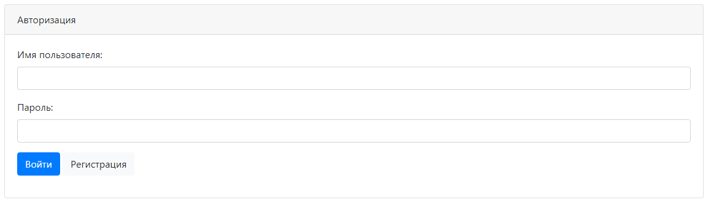
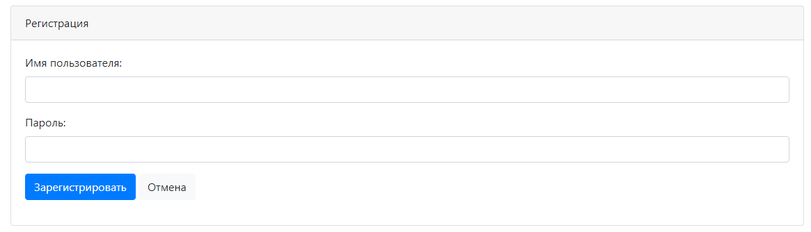
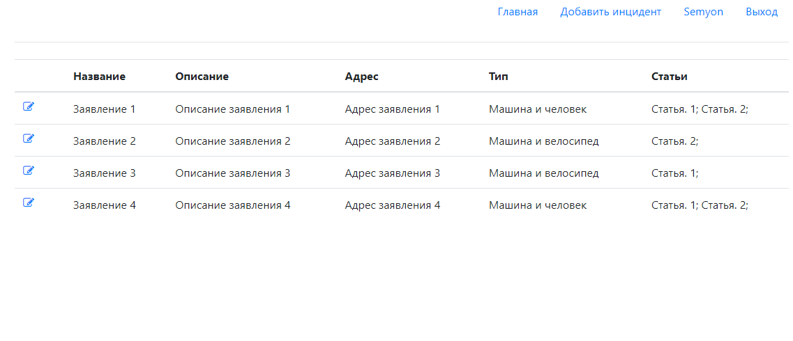
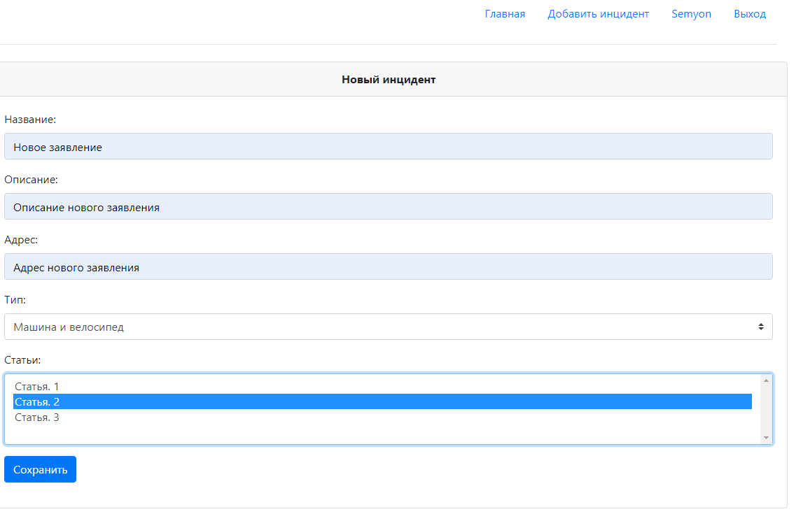
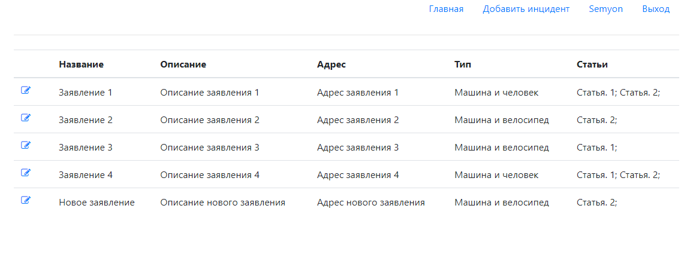

# job4j_car_accident

+ [О проекте](#О-проекте)
+ [Технологии](#Технологии)
+ [Использование](#Использование)
+ [Контакты](#Контакты)

## О проекте

Данный репозиторий представляет собой веб-приложение "Автонарушители". На веб форме можно оставлять обращения об 
автомобильных происшествиях. Обращения можно оставлять только зарегистрированным пользователям. В системе существуют две 
роли. Обычные пользователи и администраторы. В заявлении указывается: название заявления, описание, адрес, тип заявления 
и статьи. Используются фреймворки Spring и Hibernate.

## Технологии

+ Сборщик проектов **Maven**;
+ Frontend - **HTML**, **CSS**, **BOOTSTRAP**;
+ Backend - **Java 14**, **Spring MVC**, **Spring ORM**, **Spring Data**, **Spring Security**, **Hibernate**, **JSP**;
+ Логгирование - **Log4j**, **Slf4j**;
+ СУБД - **PostgreSQL**;
+ Контейнер сервлетов - **Apache Tomcat**;
+ Непрерывная интеграция - **Travis CI**;
+ Инструмент для анализа стиля кода - **Checkstyle**;

## Использование

В самом начале, если мы не авторизованы, нас перенаправляет на страницу авторизации:

---

Если необходимо, регистрируемся:

---

Авторизовываемся и попадаем на основную страницу:

На основной странице находится навигационное меню сверху и основное пространство занимают уже заведенные автонарушения.

---

Для добавления нового заявления необходимо кликнуть сверху на гиперссылку "Добавить инцидент". На этой странице 
указываются основные данные инцидента.

---

Соответственно, после добавления нового инцидента, оно отобразится в списке заявлений:

Также, слева от инцидента в списке имеется кнопка редактирования. Можно отредактировать любое заявление.

## Контакты

Становов Семён Сергеевич

Email: sestanovov@gmail.com

Telegram: [@stanovovss](https://t.me/stanovovss)